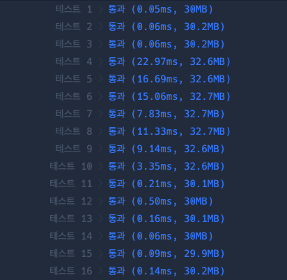
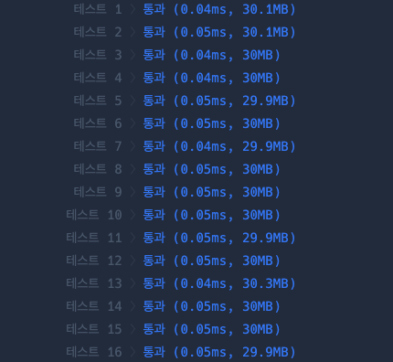

**문제설명**

두 정수 a, b가 주어졌을 때 a와 b 사이에 속한 모든 정수의 합을 리턴하는 함수, solution을 완성하세요.
예를 들어 a = 3, b = 5인 경우, 3 + 4 + 5 = 12이므로 12를 리턴합니다.

**제한사항**

- a와 b가 같은 경우는 둘 중 아무 수나 리턴하세요.
- a와 b는 -10,000,000 이상 10,000,000 이하인 정수입니다.
- a와 b의 대소관계는 정해져있지 않습니다.


**입출력 예**<br/>
|a|b|return|
|-|-|-|
|3|5|12|
|3|3|3|
|5|3|12|
<br/>

<hr/>

**문제풀이**<br/>

직관적으로 생각한 방법은 아래처럼 `a`와 `b`의 대소를 구분한 뒤 for문을 이용해 답을 구하는 것이었습니다.

``` javascript
function solution(a, b) {
    var answer = 0;
    
    const min = Math.min(a, b)
    const max = Math.max(a, b)
    
    for (let i = min; i <= max; i++) {
        answer += i
    }
    return answer;
}
```

그러나, 문제를 풀고 다른 사람의 풀이를 보니 가우스 덧셈을 이용해 푼 방식이 있어 이를 이용헤 다시 풀기로 했습니다.

유명한 수학자 가우스가 어린 나이 때 1 ~ 100의 합을 매우 쉽게 구한 방법을 이용한 것입니다.
```
1. 1 + 2 + 3 + ... + 99 + 100과 100 + 99 + ... + 3 + 2+ 1을 각 자리별로 더한다.
2. (1 + 100) + (2 + 99) + (3 + 98) + ... (99 + 2) + (100 + 1) = 101 * 100 = 10100
3. 1 ~ 100을 두 번 더한 것과 같으므로 2에서 구한 값에서 2로 나눈다.
4. 10100 / 2 = 5050
```
이를 일반식으로 만들면 이렇게 됩니다.
```
n * (min + max) / 2 = (max - min + 1) * (min + max) / 2
```
위 공식을 이용해 코드를 작성하면 아래처럼 됩니다.
```javascript
answer = (Math.abs(a-b) + 1) * (a+b) / 2
```

확실히 이전 방식보다 for문을 거치지 않으니 시간이 단축되었습니다.
- 이전 방식   
  
- 가우스 덧셈 적용   
  