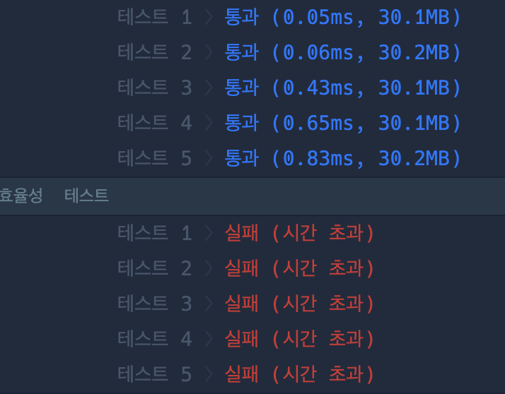

**문제설명**

수많은 마라톤 선수들이 마라톤에 참여하였습니다. 단 한 명의 선수를 제외하고는 모든 선수가 마라톤을 완주하였습니다.

마라톤에 참여한 선수들의 이름이 담긴 배열 participant와 완주한 선수들의 이름이 담긴 배열 completion이 주어질 때, 완주하지 못한 선수의 이름을 return 하도록 solution 함수를 작성해주세요.

**제한사항**
- 마라톤 경기에 참여한 선수의 수는 1명 이상 100,000명 이하입니다.
- completion의 길이는 participant의 길이보다 1 작습니다.
- 참가자의 이름은 1개 이상 20개 이하의 알파벳 소문자로 이루어져 있습니다.
- 참가자 중에는 동명이인이 있을 수 있습니다.

**입출력 예**<br/>
|participant|completion|return|
|-|-|-|
|["leo", "kiki", "eden"]|["eden", "kiki"]|"leo"|
|["marina", "josipa", "nikola", "vinko", "filipa"]|["josipa", "filipa", |"marina", "nikola"]|"vinko"|
|["mislav", "stanko", "mislav", "ana"]|["stanko", "ana", "mislav"]|"mislav"|
<br/>

**입출력 예 설명**

예제 #1

"leo"는 참여자 명단에는 있지만, 완주자 명단에는 없기 때문에 완주하지 못했습니다.

예제 #2

"vinko"는 참여자 명단에는 있지만, 완주자 명단에는 없기 때문에 완주하지 못했습니다.

예제 #3

"mislav"는 참여자 명단에는 두 명이 있지만, 완주자 명단에는 한 명밖에 없기 때문에 한명은 완주하지 못했습니다.
<br/>
<hr/>
<br/>

**문제풀이**<br/>

문제를 처음보고 든 생각은 아래의 코드와 같이 `completion`을 반복해서 `participant`에 값이 있다면 그 값을 없애는 과정을 거친 후 남은 `parictipant`의 원소를 출력하는 것이었습니다.

```javascript
function solution(participant, completion) {
    var answer = '';
    const not_complete = "";
    
    for (let name of completion) {
        const index = participant.indexOf(name);
        if (index > -1) {
            participant.splice(index, 1);
        }
    }
    answer = participant[0]
    
    return answer;
}
```

하지만 이 코드는 시간이 오래 걸려서 효율성에서 통과할 수 없었습니다.



따라서 다른 방븝을 생각했고 이 문제의 알고리즘 분류가 해시이기 때문에 이것을 이용하기로 했습니다.

먼저, `participant`의 객체로 만드는데 동명이인이 있을 수 있기 때문에 `cnt`라는 변수를 두어 이름의 등장 횟수를 카운팅했습니다. 그리고 `completion`의 원소를 위에서 만든 객체의 key로 넣어 해당 값의 `cnt`를 1을 내리고 내린 값이 0이라면 객체에서 제거하였습니다. 반복을 마친 후 남은 객체의 key를 반환하여 문제를 해결했습니다.