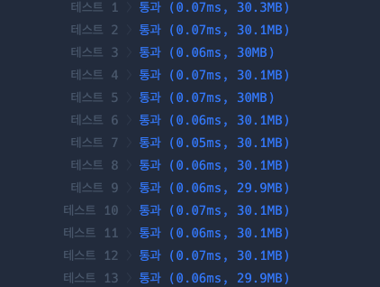
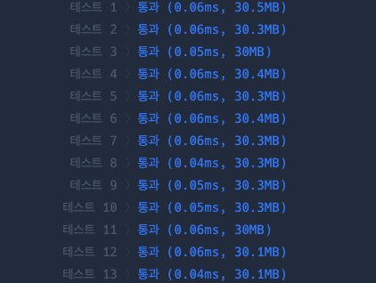

**문제 설명**

자연수 n을 뒤집어 각 자리 숫자를 원소로 가지는 배열 형태로 리턴해주세요. 예를들어 n이 12345이면 [5,4,3,2,1]을 리턴합니다.

**제한 조건**

- n은 10,000,000,000이하인 자연수입니다.

**입출력 예**

|n|return|
|-|-|
|12345|[5,4,3,2,1]|

**문제 풀이**

이 문제를 2가지 방법으로 풀 수 있다고 생각해서 각 방법으로 해결한 후 속도를 비교해보았습니다.

1. 배열을 이용해서 푸는 방법   
   `n`을 문자열로 변경 후 `split`을 이용해 배열로 만듭니다. 그 후 `reverse`를 이용해 뒤집고 `map`을 이용해 문자를 숫자로 변경합니다. 이 경우는 문제 그대로 해석해서 무조건 통과가 가능하지만, 배열을 뒤집고 다시 문자를 숫자로 바꾸는 과정에서 시간이 오래 걸릴 수 있다는 것을 짐작할 수 있습니다. 아래는 걸린 시간입니다.   

   

2. 반복문을 이용해서 푸는 방법   
   숫자에서 10으로 나눈 나머지는 맨 마지막 숫자가 나오게 되기 때문에 이를 `answer`에 `push`하게 되면 역순으로 들어가게 됩니다. 이를 `n`이 0보다 클 때까지만 반복하고 매 반복마다 `n`을 `parseInt(n/10)`이 되게 했습니다. 시간은 위의 경우하고 큰 차이가 없어 아쉬웠습니다.   

   