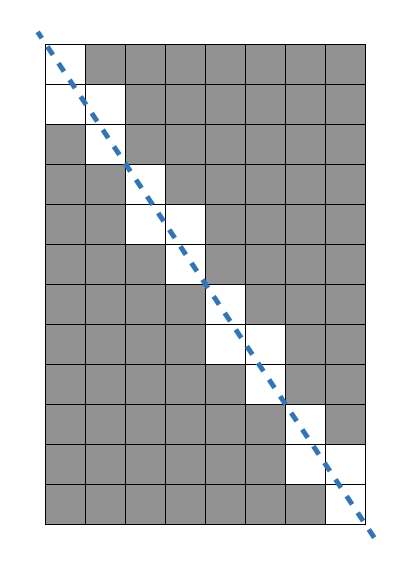

**문제설명**<br/>
가로 길이가 Wcm, 세로 길이가 Hcm인 직사각형 종이가 있습니다. 종이에는 가로, 세로 방향과 평행하게 격자 형태로 선이 그어져 있으며, 모든 격자칸은 1cm x 1cm 크기입니다. 이 종이를 격자 선을 따라 1cm × 1cm의 정사각형으로 잘라 사용할 예정이었는데, 누군가가 이 종이를 대각선 꼭지점 2개를 잇는 방향으로 잘라 놓았습니다. 그러므로 현재 직사각형 종이는 크기가 같은 직각삼각형 2개로 나누어진 상태입니다. 새로운 종이를 구할 수 없는 상태이기 때문에, 이 종이에서 원래 종이의 가로, 세로 방향과 평행하게 1cm × 1cm로 잘라 사용할 수 있는 만큼만 사용하기로 하였습니다.
가로의 길이 W와 세로의 길이 H가 주어질 때, 사용할 수 있는 정사각형의 개수를 구하는 solution 함수를 완성해 주세요.<br/>
<br/>

**제한사항**
* W, H : 1억 이하의 자연수<br/>
<br/>

**입출력 예**<br/>
|W|H|result|
|------|---|---|
|8|12|80|<br/>
<br/>

**입출력 예 설명**<br/>
입출력 예 #1<br/>
가로가 8, 세로가 12인 직사각형을 대각선 방향으로 자르면 총 16개 정사각형을 사용할 수 없게 됩니다. 원래 직사각형에서는 96개의 정사각형을 만들 수 있었으므로, 96 - 16 = 80 을 반환합니다.
</img><br/>
<br/>
<hr/>
<br/>

**문제풀이**<br/>
문제를 처음봤을 때 든 생각은 입력받은 w, h의 최대 공약수로 나눈 최소 단위에서 제거한 사각형을 구한 후 반복하면 문제가 해결될 것이라고 생각했습니다.<br/>

1. gcd 구하기<br/>
  `큰 값을 작은 값의 최대 공약수가 큰 값을 작은 값으로 나눈 나머지와 큰 값의 최대 공약수가 같다`는 유클리드 호제법을 이용했습니다.<br/>
   ```
   function gcd(minVal, maxVal) {
     const r = minVal & maxVal;
     return r === 0 ? maxVal : gcd(maxVal, r);
   }
   ```
2. 제거할 사각형 구하기<br/>
   예제에서 제시된 최소 단위는 가로 2, 세로 3으로 되어 있고 이 때의 제거될 사각형의 개수는 4가 됩니다. 이 수는 `최소 단위의 제거할 사각형 = 최소 단위 가로 + 최소 단위 세로 - 1 = 2 + 3 - 1 = 4`와 같으며 다른 경우에도 모두 적용됩니다.<br/>
   최대 공약수의 값이 `g`라고 할 때, 구해야하는 모든 제거할 사각형은<br/>
   `g * 최소 단위의 사각형 = g * (최소 단위 가로 + 최소 단위 세로 - 1) = w + h - g`가 됩니다.
3. 정답 구하기<br/>
   2번에서 구한 제거할 사각형을 전체 사각형에서 빼면 정답이 됩니다. 제거할 사격형의 개수를 r이라고 할 때, `answer = w * h - r`이 됩니다.