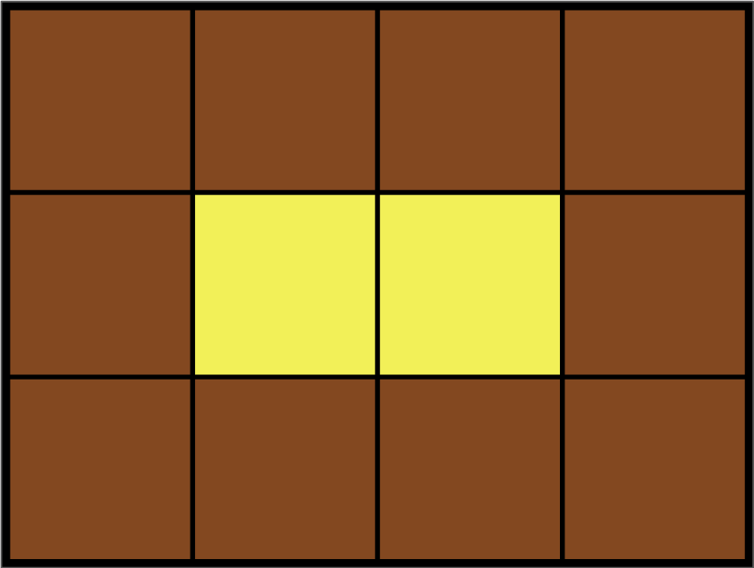

**문제설명**

Leo는 카펫을 사러 갔다가 아래 그림과 같이 중앙에는 노란색으로 칠해져 있고 테두리 1줄은 갈색으로 칠해져 있는 격자 모양 카펫을 봤습니다.



Leo는 집으로 돌아와서 아까 본 카펫의 노란색과 갈색으로 색칠된 격자의 개수는 기억했지만, 전체 카펫의 크기는 기억하지 못했습니다.

Leo가 본 카펫에서 갈색 격자의 수 brown, 노란색 격자의 수 yellow가 매개변수로 주어질 때 카펫의 가로, 세로 크기를 순서대로 배열에 담아 return 하도록 solution 함수를 작성해주세요.


**제한사항**

- 갈색 격자의 수 brown은 8 이상 5,000 이하인 자연수입니다.
- 노란색 격자의 수 yellow는 1 이상 2,000,000 이하인 자연수입니다.
- 카펫의 가로 길이는 세로 길이와 같거나, 세로 길이보다 깁니다.


**입출력 예**<br/>
|brown|yellow|return|
|-|-|-|
|10|2|[4, 3]|
|8|1|[3, 3]|
|24|24|[8, 6]|
<br/>
<hr/>
<br/>

**문제풀이**<br/>

문제를 풀기 위해 생각한 것은 가능한 열`column`의 수와 조건에 부합되는 `yellow`의 수라고 생각했습니다.

먼저, 가능한 열의 수에 대해서 설명하겠습니다. `brown`은 `yellow`를 감싸는 형태이기 때문에 최소 3개의 행`row`이 필요합니다. 이 때 가능한 최대의 열의 개수는 `brown` + `yellow`를 `row`로 나눈 값이 될 것입니다.

총 카펫의 개수에서 행을 나눈 것이 열이 되기 때문입니다.

이를 이용해서 아래 코드를 생각했습니다.

```javascript
for (row = 3; row <= (brown + yellow) / row; row++) {
  ...
}
```

그 다음으로 생각한 것은 조건에 부합되는 `yellow`의 수입니다.
`yellow`의 수는 테두리 안쪽에 있기 때문에 (열-2) * (행 - 2)와 같게 됩니다. 따라서 위에서 선언한 `for`문 안에서 해당 조건을 만족할 때 최선의 `column`과 `row`를 구할 수 있다고 볼 수 있습니다. 

```javascript
for (row = 3; row <= (brown + yellow) / row; row++) {
  column = Math.floor((brown + yellow) / row);
  if ((row - 2) * (column - 2) === yellow) break;
}
```