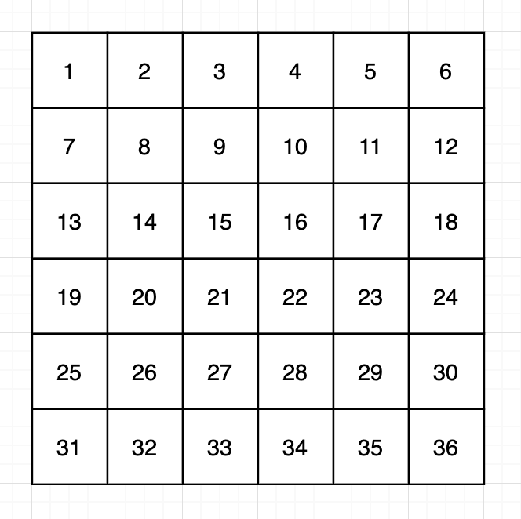
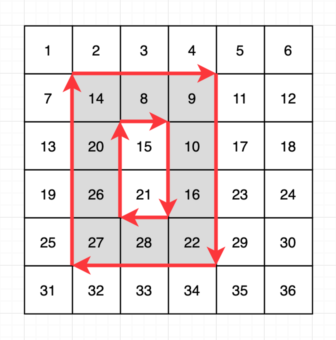
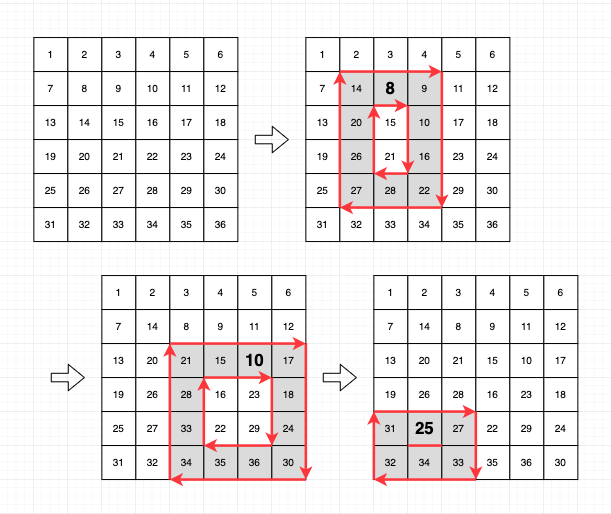
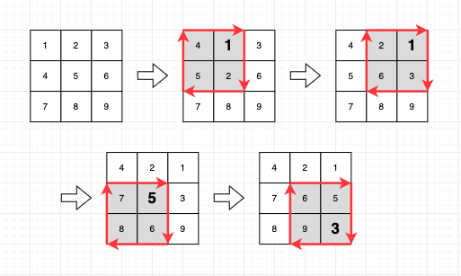

**문제설명**<br/>
rows x columns 크기인 행렬이 있습니다. 행렬에는 1부터 rows x columns까지의 숫자가 한 줄씩 순서대로 적혀있습니다. 이 행렬에서 직사각형 모양의 범위를 여러 번 선택해, 테두리 부분에 있는 숫자들을 시계방향으로 회전시키려 합니다. 각 회전은 (x1, y1, x2, y2)인 정수 4개로 표현하며, 그 의미는 다음과 같습니다.<br/>
* x1 행 y1 열부터 x2 행 y2 열까지의 영역에 해당하는 직사각형에서 테두리에 있는 숫자들을 한 칸씩 시계방향으로 회전합니다.<br/>
  
다음은 6 x 6 크기 행렬의 예시입니다.<br/>
</img><br/>
이 행렬에 (2, 2, 5, 4) 회전을 적용하면, 아래 그림과 같이 2행 2열부터 5행 4열까지 영역의 테두리가 시계방향으로 회전합니다. 이때, 중앙의 15와 21이 있는 영역은 회전하지 않는 것을 주의하세요.<br/>
</img><br/>
행렬의 세로 길이(행 개수) rows, 가로 길이(열 개수) columns, 그리고 회전들의 목록 queries가 주어질 때, 각 회전들을 배열에 적용한 뒤, 그 회전에 의해 위치가 바뀐 숫자들 중 가장 작은 숫자들을 순서대로 배열에 담아 return 하도록 solution 함수를 완성해주세요.<br/>
<br/>

**제한사항**
* rows는 2 이상 100 이하인 자연수입니다.
* columns는 2 이상 100 이하인 자연수입니다.
* 처음에 행렬에는 가로 방향으로 숫자가 1부터 하나씩 증가하면서 적혀있습니다.
   * 즉, 아무 회전도 하지 않았을 때, i 행 j 열에 있는 숫자는 ((i-1) x columns + j)입니다.
* queries의 행의 개수(회전의 개수)는 1 이상 10,000 이하입니다.
* queries의 각 행은 4개의 정수 [x1, y1, x2, y2]입니다.
  * x1 행 y1 열부터 x2 행 y2 열까지 영역의 테두리를 시계방향으로 회전한다는 뜻입니다.
  * 1 ≤ x1 < x2 ≤ rows, 1 ≤ y1 < y2 ≤ columns입니다.
  * 모든 회전은 순서대로 이루어집니다.
  * 예를 들어, 두 번째 회전에 대한 답은 첫 번째 회전을 실행한 다음, 그 상태에서 두 번째 회전을 실행했을 때 이동한 숫자 중 최솟값을 구하면 됩니다.
<br/>

**입출력 예**<br/>

|rows|columns|queries|result|
|-|-|-|-|
|6|6|[[2,2,5,4],[3,3,6,6],[5,1,6,3]]|[8, 10, 25]|
|3|3|[[1,1,2,2],[1,2,2,3],[2,1,3,2],[2,2,3,3]]|[1, 1, 5, 3]|
|100|97|[[1,1,100,97]]|[1]|<br/>
<br/>

**입출력 예 설명**<br/>
입출력 예 #1<br/>
* 회전을 수행하는 과정을 그림으로 표현하면 다음과 같습니다.<br/>
  </img><br/>

입출력 예 #2<br/>
* 회전을 수행하는 과정을 그림으로 표현하면 다음과 같습니다.<br/>
 </img><br/>

입출력 예 #3<br/>
* 이 예시에서는 행렬의 테두리에 위치한 모든 칸들이 움직입니다. 따라서, 행렬의 테두리에 있는 수 중 가장 작은 숫자인 1이 바로 답이 됩니다.<br/>
<br/>
<hr/>
<br/>

**문제풀이**<br/>
1. 입력받은 rows와 columns의 크기만큼의 숫자들을 저장하는 2차원 배열인 `num_arr`을 생성합니다.
   ```
   const num_arr = Array(rows).fill(0).map(() => Array(columns));
   
   for (let i = 0; i < rows; i++) {
     for (let j = 0; j < columns; j++) {
       num_arr[i][j] = i * columns + j + 1;
      }
   }
   ```
2. `querys`의 한 `query`에서 각 좌표 `r1, c1, r2, c2`로 분리해 저장합니다. `pos - 1`을 하는 이유는 `num_arr`의 인덱스로 사용되기 때문입니다.
   ```
   const [r1, c1, r2, c2] = query.map(pos => pos - 1);
   ```
3. `query`의 좌표에 의해 결정될 숫자 배열을 저장할 `queue`를 생성합니다.
   ```
   const queue = [];
   ```
4. `queue`에 들어갈 좌표들을 구합니다.
   ```
   for (let i = 0; i < c2 - c1; i++) queue.push(num_arr[r1][c1 + i]);
   for (let i = 0; i < r2 - r1; i++) queue.push(num_arr[r1 + i][c2])
   for (let i = 0; i < c2 - c1; i++) queue.push(num_arr[r2][c2 - i])
   for (let i = 0; i < r2 - r1; i++) queue.push(num_arr[r2 - i][c1])
   ```
5. rotation을 한 후, 최솟값을 answer에 저장합니다.
   ```
   queue.unshift(queue.pop());
   answer.push(Math.min(...queue));
   ```
6. num_arr을 다시 설정합니다.
   ```
   for (let i = 0; i < c2 - c1; i++) num_arr[r1][c1 + i] = queue.shift();
   for (let i = 0; i < r2 - r1; i++) num_arr[r1 + i][c2] = queue.shift();
   for (let i = 0; i < c2 - c1; i++) num_arr[r2][c2 - i] = queue.shift();
   for (let i = 0; i < r2 - r1; i++) num_arr[r2 - i][c1] = queue.shift();
   ```